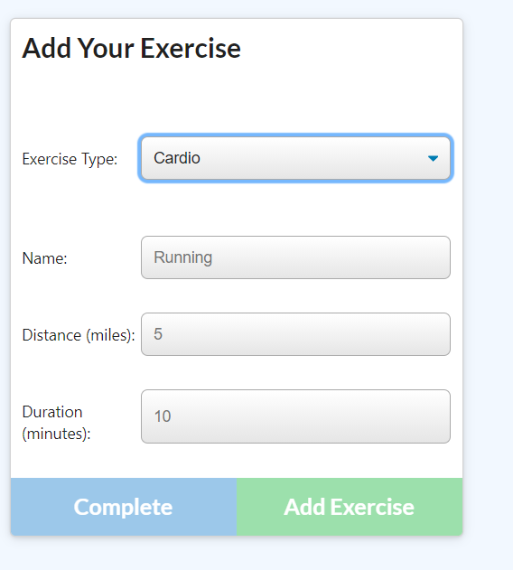

# Fitness-tracker  

## User Story

* As a user, I want to be able to view create and track daily workouts. I want to be able to log multiple exercises in a workout on a given day. I should also be able to track the name, type, weight, sets, reps, and duration of exercise. If the exercise is a cardio exercise, I should be able to track my distance traveled.

## Business Context

A consumer will reach their fitness goals more quickly when they track their workout progress.

## Acceptance Criteria

When the user loads the page, they should be given the option to create a new workout or continue with their last workout.

The user should be able to:

  * Add exercises to the most recent workout plan.

  * Add new exercises to a new workout plan.

  * View the combined weight of multiple exercises from the past seven workouts on the `stats` page.

  * View the total duration of each workout from the past seven workouts on the `stats` page.

The following screenshots show how the app works

## TECHNOLOGIES USED
   * NODE JS
   * MONGODB
   * MONGOOSE DATA MODELER
   * EXPRESS JS
   * JAVASCRIPT
   * CSS 
   * CANVAS
   * MORGAN as DEV DEPENDENCY

It shows the consolidated info from the last workout record with the total durations of each workout

when you want to create a new workout

workout types can be either resistance or cardio

If the workout type is acardio the following inputs are shown for the user to enter

If we want to check the consolidated workouts for last 7 workouts, the user can click the dashoard page in the nav bar, it navigates to the stats page with the following charts

The app is deployed to herokku
Please check the following link
[herokku link](https://obscure-depths-69292.herokuapp.com/)